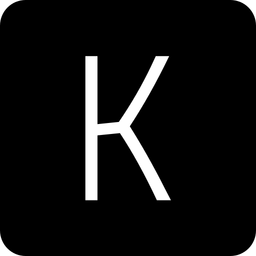

<h1>kirna.at</h1>

My personal portfolio website

# Tech Stack

- [NextJS][nextjs] - UI framework
- [Vercel][vercel] - Hosting and Deployment
- [Sanity.io][sanity]: Headless CMS and Content Lake

## License & Usage
This portfolio is MIT-licensed so you are free to use it as an inspiration or you can just copy the whole thing (excluding my personal content of course), I don't really mind. Just make sure you link back to [kirna.at][site] on the footer section as attribution to the original source.

<!-- Link Refs -->

[nextjs]: https://nextjs.org
[vercel]: https://vercel.com
[sanity]: https://sanity.io